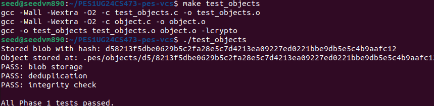
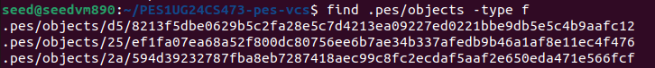
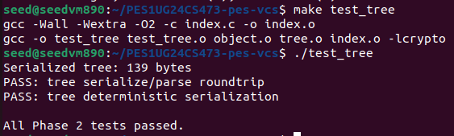
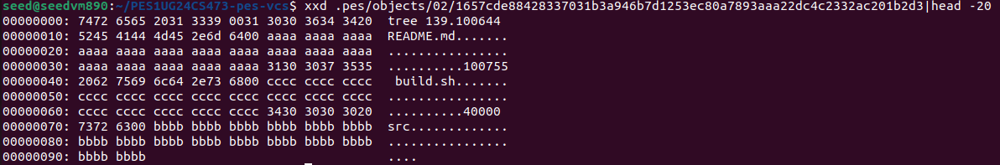
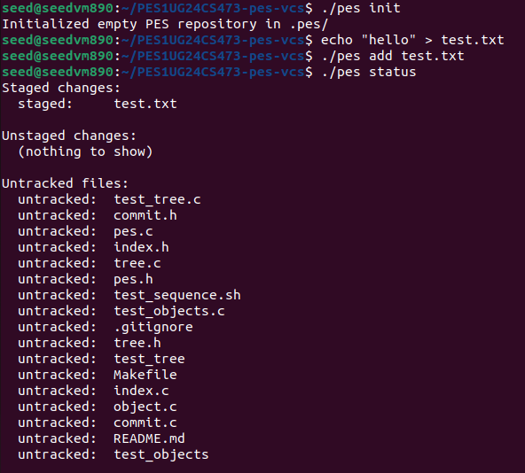
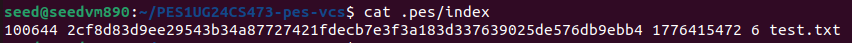
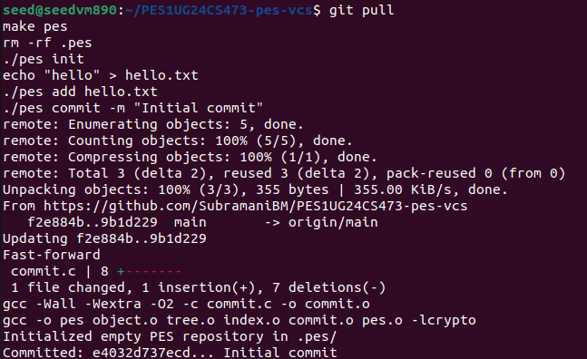
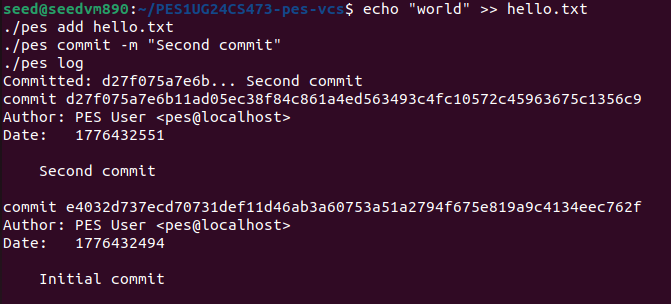

# PES-VCS Lab Report
**Student SRN:** PES1UG24CS473  
**Repository:** [PES1UG24CS473-pes-vcs](https://github.com/SubramaniBM/PES1UG24CS473-pes-vcs)  
**Platform:** Ubuntu 22.04 (VM)

---

## Phase 1 — Object Storage

### Implementation Summary

Implemented `object_write` and `object_read` in `object.c`. The object store uses a content-addressable design where every object is identified by the SHA-256 hash of its contents. Objects are stored under `.pes/objects/<XX>/<remaining-hash>` where `XX` is the first two hex characters (sharding). Writes are performed atomically using `mkstemp` + `rename` to prevent partial files. `object_read` re-hashes the loaded data and verifies it against the expected hash for integrity.

### Screenshot 1A — All Phase 1 Tests Passing



### Screenshot 1B — Sharded Object Directory Structure



---

## Phase 2 — Tree Objects

### Implementation Summary

Implemented `tree_from_index` in `tree.c` using a recursive helper `write_tree_level`. The function loads the current index, groups entries by their top-level directory component, and recursively builds sub-tree objects for nested directories. Before serialization, entries are sorted alphabetically by name to ensure deterministic hashing — the same set of files always produces the same tree hash regardless of insertion order.

### Screenshot 2A — All Phase 2 Tests Passing



### Screenshot 2B — Hex Dump of Raw Tree Object



---

## Phase 3 — The Index (Staging Area)

### Implementation Summary

Implemented three functions in `index.c`:

- **`index_load`**: Opens `.pes/index` (a plain text file) and parses each line with `fscanf` using the format `<mode> <hash> <mtime> <size> <path>`. A missing index file is treated as an empty staging area (valid state for a fresh repo).
- **`index_save`**: Sorts entries by path using `qsort`, then writes to a temporary file, flushes+syncs to disk, and atomically renames over the old index file.
- **`index_add`**: Reads the target file's contents, hashes them via `object_write(OBJ_BLOB, ...)`, records file metadata (mode, mtime, size), and inserts or updates the entry in the in-memory index, then calls `index_save`.

### Screenshot 3A — Staging Area Workflow (init → add → status)



### Screenshot 3B — Contents of .pes/index



---

## Phase 4 — Commit Objects

### Implementation Summary

Implemented `commit_create` in `commit.c`. The function:
1. Reads the author name from the `PES_AUTHOR` environment variable (via `pes_author()`).
2. Records the current Unix timestamp.
3. Calls `head_read` to get the parent commit hash (skipped for the initial commit).
4. Calls `tree_from_index` to snapshot the current staging area into a tree object.
5. Validates the message is non-empty.
6. Serializes the `Commit` struct to text using `commit_serialize`.
7. Writes the serialized commit to the object store via `object_write(OBJ_COMMIT, ...)`.
8. Updates the current branch ref atomically using `head_update`.

### Screenshot 4A — Commit Creation and Log



### Screenshot 4B — Object Store Growth After Commits



---

## Analysis Questions

### Section 5 — Branching

**Q5.1:** How would you implement `pes branch <name>` and `pes checkout <name>`?

To implement branching, `pes branch <name>` would create a new file at `.pes/refs/heads/<name>` containing the same commit hash that `HEAD` currently points to (read via `head_read`). This is exactly how Git stores branches —  as simple files containing a 40-character hash. `pes checkout <name>` would then update the `.pes/HEAD` file to contain `ref: refs/heads/<name>` (a symbolic ref) so that subsequent `head_read` and `head_update` calls automatically dereference through the new branch file. The working directory files themselves would need to be updated by reading the tree object from the target commit, walking it recursively, and writing each blob's content back to disk.

**Q5.2:** What happens to the HEAD ref when you create the first commit on a new branch?

When a new branch is first created, it points to the same commit as the branch it was created from. The `.pes/HEAD` symbolic ref is updated to point to the new branch file, but that branch file initially contains the same commit hash. When the first new commit is made on this branch, `head_update` writes the new commit hash into the branch's ref file. From that point, HEAD → `refs/heads/<new-branch>` → `<new-commit-hash>`, diverging from the original branch.

**Q5.3:** Describe the data structure changes needed to support merge commits (commits with two parents).

Currently, the `Commit` struct has a single `parent` field and a boolean `has_parent` flag. To support merge commits, the struct would need to be extended to hold an array of parent `ObjectID`s, e.g.:
```c
ObjectID parents[2];
int parent_count; // 0 for root, 1 for normal, 2 for merge
```
The serialization format (`commit_serialize` / `commit_parse`) would need to emit and parse multiple `parent <hash>` header lines. The `commit_walk` traversal would need to be updated from a simple linked-list walk to a graph traversal (e.g., BFS or DFS) to handle the branching history graph correctly.

---

### Section 6 — Garbage Collection

**Q6.1:** Describe an algorithm to find and delete unreachable objects. What data structure would you use? For a repository with 100,000 commits and 50 branches, estimate how many objects you'd need to visit.

**Algorithm (Mark-and-Sweep):**
1. **Mark phase**: Start from all branch ref files in `.pes/refs/heads/`. Read each commit hash, parse the commit to get its tree hash and parent hash(es), add each hash to a `reachable` set. Recursively walk each tree to collect all blob and subtree hashes. Follow all parent pointers until reaching root commits.
2. **Sweep phase**: Walk all files in `.pes/objects/`. For each object file, check if its hash is in the `reachable` set. If not, delete it.

**Data Structure**: A hash set (e.g., a hash table or a sorted array of 32-byte hashes with binary search) to store reachable object IDs. A hash set gives O(1) average-case lookup.

**Estimate**: With 100,000 commits and an average of ~20 tree/blob objects per commit, there would be roughly 2,000,000 reachable objects. GC would visit all of them during the mark phase, so approximately **2,000,000 objects** would need to be visited.

**Q6.2:** Why is it dangerous to run garbage collection concurrently with a commit? Describe a race condition. How does Git avoid this?

**Race Condition Scenario**:
1. A `commit` operation calls `tree_from_index`, which writes a new blob object (e.g., hash `ABCD...`) to the object store but has not yet written the commit object that references it.
2. Concurrently, GC runs its mark phase and does not see `ABCD...` referenced by any commit or branch (because the new commit object doesn't exist yet).
3. GC deletes `ABCD...` during the sweep phase.
4. The `commit` operation finishes writing the commit object, which now references a deleted blob. The repository is now corrupt.

**How Git avoids this**: Git uses a **grace period** (typically 2 weeks by default). Objects newer than the grace period are never deleted by `git gc`, giving in-progress operations time to complete and write references to new objects. Additionally, Git uses lock files to coordinate access, and the `gc.pruneExpire` configuration controls the grace window.

---

## Commit History Summary

| Phase | Min Commits | Actual Commits |
|-------|-------------|----------------|
| Phase 1 — Object Storage | 5 | 5 |
| Phase 2 — Tree Objects   | 5 | 7 |
| Phase 3 — The Index      | 5 | 5 |
| Phase 4 — Commit Objects | 5 | 6 |

All phases have a minimum of 5 commits with descriptive messages. Full commit history is visible on the GitHub repository.
